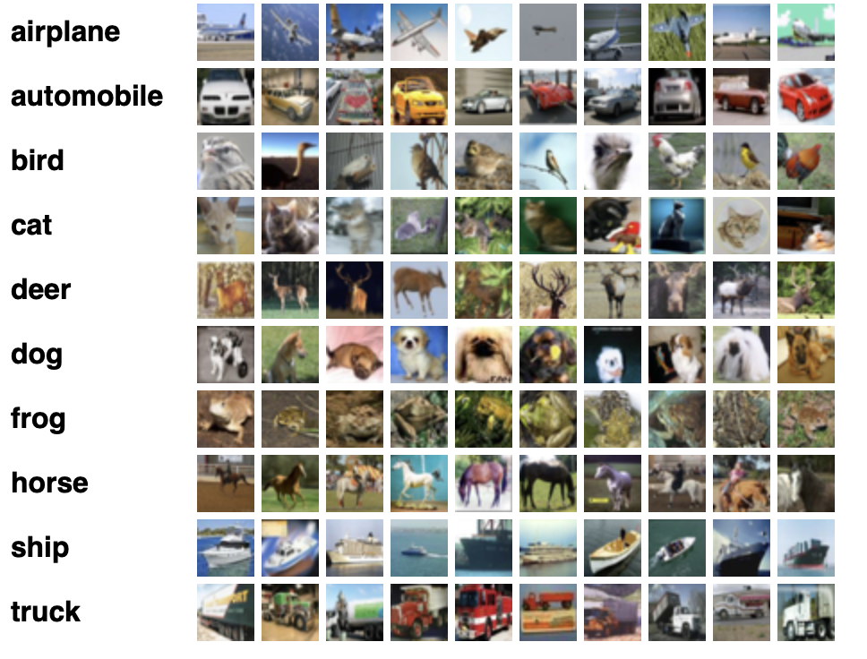
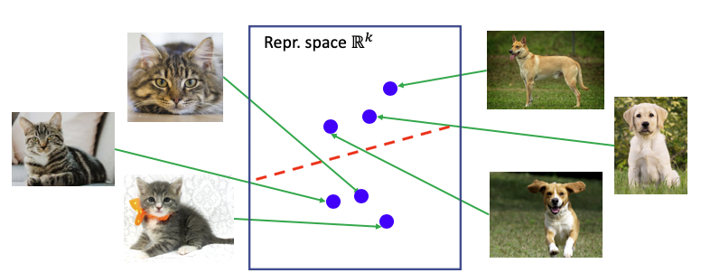
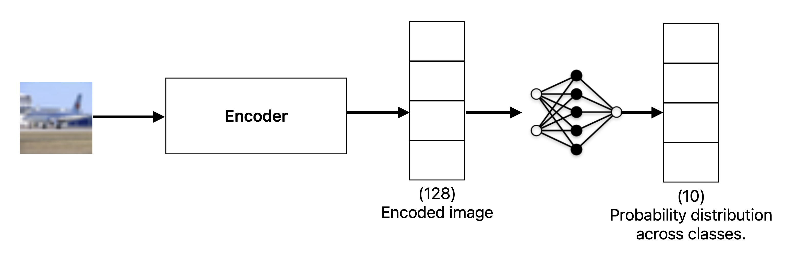
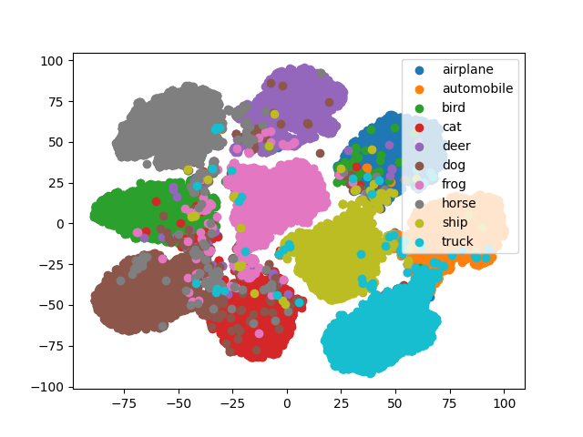
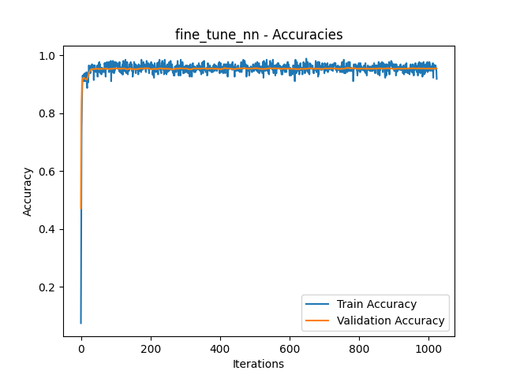

### Dataset

CIFAR-10 dataset (https://www.cs.toronto.edu/~kriz/cifar.html) contains 32x32 color images (RBG images with 3 channel) with labels across 10 different classes like Airplane, Automobile, Bird, and so on. And the dataset has 60k images which are divided into 50k training images and 10k testing images. 


*(Image credit: https://www.cs.toronto.edu/~kriz/cifar.html)*


### About Contrastive Learning


*(Image credit: https://ai.stanford.edu/blog/understanding-contrastive-learning/)*


**Contrastive learning** is a self-supervised learning technique in which a model (encoder) learns to map input data into a representation space where **similar samples are positioned closer together** and **dissimilar samples are pushed farther apart.**

We use **triplet loss** to train the encoder:

$$
{\displaystyle L=\sum _{i=1}^{m}\max {\Big (}\Vert f(A^{(i)})-f(P^{(i)})\Vert _{2}^{2}-\Vert f(A^{(i)})-f(N^{(i)})\Vert _{2}^{2}+\alpha ,0{\Big )}}
$$

here: 
1. $f(.)$ is our encoder.
2. $\alpha$ is a hyper parameter called margin, and $m$ is the no. of samples we are using to evaluate the loss.
3. $A$ is the anchor point, $P$ is the positive point, and $N$ is the negative point.

[](https://en.wikipedia.org/wiki/File:Triplet_Loss_Minimization.png)
(*Image credit:* https://en.wikipedia.org/wiki/Triplet_loss)

**Anchor**: The reference data point used as the basis for comparison.  
**Positive**: A data point from the **same class** as the anchor.
**Negative**: A data point from a **different class** than the anchor.

During training, we sample an **anchor (A)**, then select a **positive (P)** that from the same class, and a **negative (N)** from a different class. The model is trained to **minimize the distance between A and P**, and **maximize the distance between A and N** in the learned representation space, which is what the triplet loss function is doing.

### Description of training



We first trained the encoder as described above and we want to classify the images into one of the 10 categories and for this we fine-tuned a small neural network that takes the encoder's output as the input. We used cross entropy loss function for the training of the neural network.

### Results


*t-SNE plot of output of encoder*



**Accuracy**

| **Ours** | **CNN** | **Multi-class logistic regression** |
|----------|---------|-------------------------------------|
| **86%**  | 70%     |                 30%                 |

### Downloading the dataset

```bash
wget https://www.cs.toronto.edu/~kriz/cifar-10-python.tar.gz && 
python3 combine_data.py &&
rm -r cifar-10-batches-py cifar-10-python.tar.gz
```

*This will save the training and test images in the folder* `data`.

### Running the program
*TODO*
